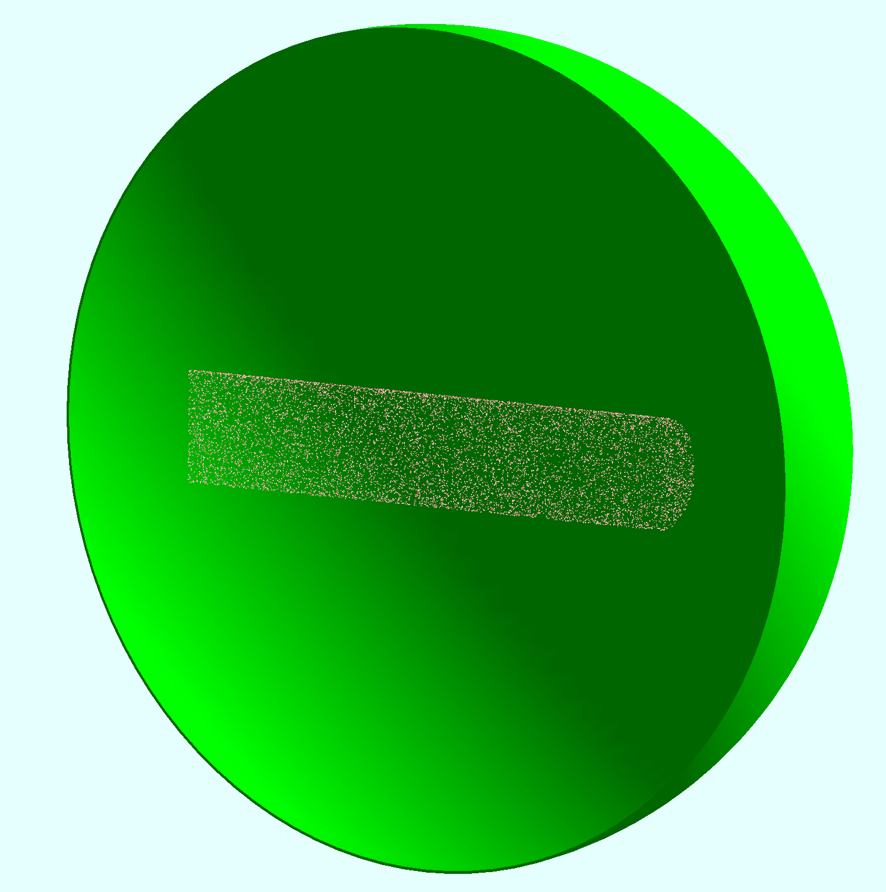

## Elastic Scattering Test

The geometry consists of a 20 cm long LH2 target. The beam is 11GeV electron.
A sensitive sphere is collecting all the particles produced in the target satisfying 
the following conditions:

- theta angle greater than 2 degrees

The scoring follows the B5 example: 

- ntuple declaration in RunAction constructor, 
- ntuple filling in EndOfEventAction,
- ntuple writing in RunAction.

## Geometry
1
The target cell is a 20 cm long cylinder with a 2 cm diameter. 
The target is placed in the center of the world volume. 





## Installation

First, clone the geant4 validation repository:
We assume `/path/to/g4-validation-clone` is the path to the geant4 validation repository.

Here we use the JLab `g4install` modules:

```shell
module use /scigroup/cvmfs/geant4/modules
module load geant4
```

```shell
git clone https://github.com/JeffersonLab/g4-validation.git
```

Now compile the geant4 eleastic library in a separate directory.

We assume `/path/to/elastic` is the path to where to install the elastic library.


With 4 cores (modify accordingly), using eleastic as the build directory:

- cd `/path/to/elastic`
- cmake`/path/to/g4-validation-clone`/hallb/elastic
- make -j8

Optionally, add -DCMAKE_VERBOSE_MAKEFILE=ON to the cmake command for compilation verbosity


## Physics List

The example uses the geant4 extensible physics list, defined in the common source 
code at the root of this repo. 
The default is FTFP_BERT.
The option -p physList can be used to select alternative physics modules and constructors.

For example:

`-p FTFP_BERT_EMX`  would replace the standard e.m. physics with G4EmStandardPhysics_option3

`-p QGSP_BERT+G4OpticalPhysics` would use QGSP_BERT and G4OpticalPhysics

`-p QGSP_FTFP_BERT+G4RadioactiveDecayPhysics+G4OpticalPhysics` would use QGSP_FTFP_BERT, 
G4RadioactiveDecayPhysics and G4OpticalPhysics


To print all the geant4 available physics modules and their constructors, use the `pap` option
 

## Root output

The scoring is done with the sensitive detector volume, following the B5 example.
The output is a root file with a tree containing the following variables:

- pid: particle id
- x: x coordinate of the particle hitting the sensitive volume
- y: y coordinate of the particle hitting the sensitive volume
- z: z coordinate of the particle hitting the sensitive volume
- px: x component of the particle momentum
- py: y component of the particle momentum
- pz: z component of the particle momentum


## Run :

**Notice that each event will contain 1000 beam electrons.**

To list all the available options:

```shell
elastic -h

 Usage: 

  elastic [-n number of events] [-m batch macro ] [-u UIsession ] [-t nThreads] 
          [-p physList ] [-h | --help] [ -pap | --printAvailablePhysics ] [-beam beam_eneregy] 
          [-target target_mass] [-o output file] [ -seed #] 

  > The default number of threads is equal to the number of available CPU cores. 
  > The default physList is "FTFP_BERT". 
    It can be replaced by any of the available physics modules and compounded with additional physics 
    constructors. For example: 

     -p FTFP_BERT_EMX  would replace the standard e.m. physics with G4EmStandardPhysics_option3
     -p QGSP_BERT+G4OpticalPhysics would use QGSP_BERT and G4OpticalPhysics
     -p QGSP_FTFP_BERT+G4RadioactiveDecayPhysics+G4OpticalPhysics would use  QGSP_FTFP_BERT, G4RadioactiveDecayPhysics and G4OpticalPhysics

 The beam energy and target mass can be set with the -beam and -target options. Both options are in GeV
 The seeds initialize the random engine. Set to 0 to use CPU clock and process ID. 
 To print all Geant4 available physics modules and constructors use the -pap option 
```

### - Batch mode:


Run in Batch mode 100 events (this will contain 100,000 beam electrons)

```shell
./elastic -n 100
```


