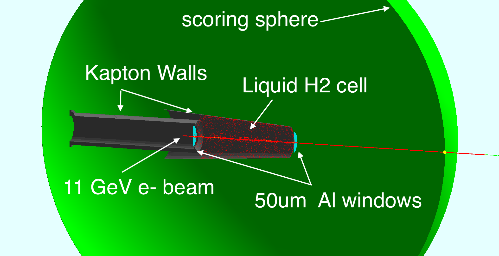

## RGA Test

The RGA experiment has a 5 cm long LH2 target. The beam is 11GeV electron.

## Geometry

The target cell is a 5 cm long cylinder with a 2 cm diameter. 
The target is placed in the center of the world volume. 

Two 50 um aluminum windows are placed at the entrance and exit of the target cell.

A torlon tube is placed before the cell and a torlon polycone simulate the cell walls.

## Compilation

With 4 cores (modify accordingly):

 - cmake .
 - make -j4

## Physics List

The example uses the geant4 extensible physics list, defined in the common source code at the root of this repo. 
The default is FTFP_BERT.
The option -p physList can be used to select alternative physics modules and constructors.

For example:

`-p FTFP_BERT_EMX`  would replace the standard e.m. physics with G4EmStandardPhysics_option3

`-p QGSP_BERT+G4OpticalPhysics` would use QGSP_BERT and G4OpticalPhysics

`-p QGSP_FTFP_BERT+G4RadioactiveDecayPhysics+G4OpticalPhysics` would use QGSP_FTFP_BERT, G4RadioactiveDecayPhysics and G4OpticalPhysics

To print all geant4 available physics modules and constructors use the -pap option
 
## Run :

### - Batch mode:

`./rga`

## ROOT Analysis:
